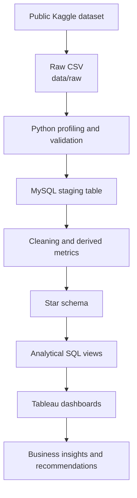

# Architecture

```mermaid
flowchart TD
    A[Public Kaggle dataset] --> B[Raw CSV<br/>data/raw]
    B --> C[Python profiling and validation]
    C --> D[MySQL staging table]
    D --> E[Cleaning and derived metrics]
    E --> F[Star schema]
    F --> G[Analytical SQL views]
    G --> H[Tableau dashboards]
    H --> I[Business insights and recommendations]
```

Raw data is not edited. The SQL workflow creates a staging layer, then dimensions and an order-item fact table. Tableau connects to the views, not to raw source data.
