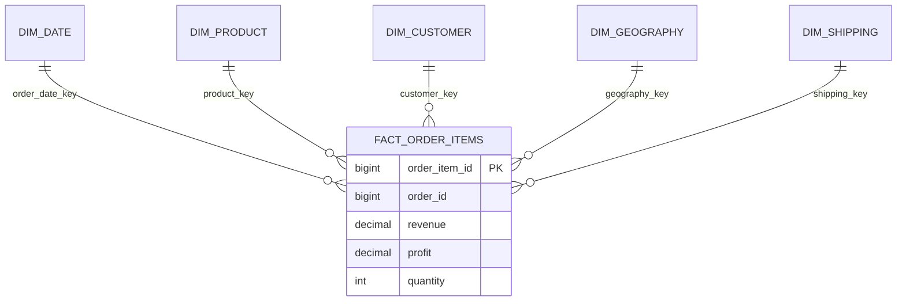

# Data Model

## Grain

`fact_order_items` contains one row per source **Order Item Id**. A single order can therefore have more than one fact row. Revenue and profit must be aggregated at the fact grain; order counts use `COUNT(DISTINCT order_id)`.

## Entities

- **fact_order_items** — item-level commercial and fulfillment measures.
- **dim_date** — calendar attributes derived from order date.
- **dim_product** — source product, category, and department attributes.
- **dim_customer** — surrogate customer key, segment, and non-sensitive location attributes; no name, email, password, or street is loaded.
- **dim_geography** — destination market, region, country, state, city, and latitude/longitude when present.
- **dim_shipping** — shipping mode, delivery status, actual/scheduled days, and the source late-delivery-risk flag.

The model intentionally has no supplier or inventory dimension.

Surrogate keys keep the fact compact and preserve source identifiers as business keys. The source import remains immutable in `stg_dataco_raw`; all downstream tables are regenerated.
